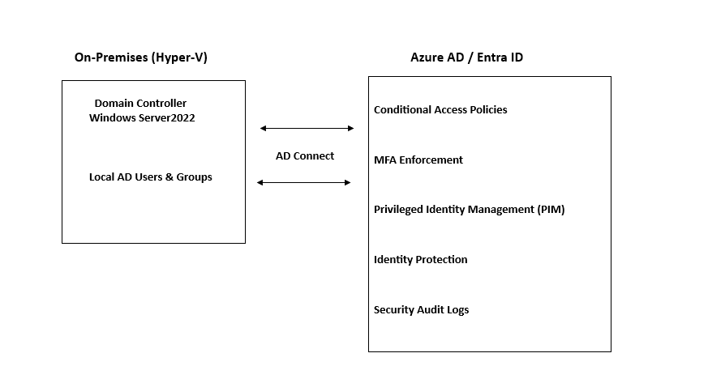

# 🔐 Project-2-Azure-Entra-ID-Security-Hardening

## Overview
Complete Azure Active Directory security hardening 
implementation for a hybrid environment including:
- Windows Server 2022 Domain Controller (Hyper-V)
- Azure Arc connected servers
- Microsoft Entra ID (Azure AD)

## Architecture


## Security Controls Implemented

### Conditional Access Policies (5 Policies)
| Policy | Purpose |
|--------|---------|
| CA001 | Require MFA for All Administrators |
| CA002 | Require MFA for All Users |
| CA003 | Block Legacy Authentication |
| CA004 | Block High Risk Sign-ins |
| CA005 | Require MFA for Medium Risk |

### Identity Security
- MFA registration audit for all users
- Privileged account audit and review
- Identity Protection risk monitoring
- Sign-in log analysis and reporting

### Compliance Reporting
- Automated HTML security reports
- CSV exports for all findings
- Risk user identification
- Admin role security checks

## Prerequisites
- Azure Subscription
- Microsoft Entra ID (P1 or P2 for CA)
- PowerShell 7.x
- Microsoft.Graph PowerShell module
- Az PowerShell module

## Deployment Order

```powershell
# Step 1: Get tenant baseline
.\01-tenant-baseline\get-tenant-security-info.ps1

# Step 2: Disable security defaults
.\01-tenant-baseline\enable-security-defaults.ps1

# Step 3: Create CA policies
.\02-conditional-access\ca-require-mfa-admins.ps1
.\02-conditional-access\ca-require-mfa-allusers.ps1
.\02-conditional-access\ca-block-legacy-auth.ps1
.\02-conditional-access\ca-block-risky-signin.ps1

# Step 4: Check MFA status
.\03-mfa-enforcement\check-mfa-status.ps1

# Step 5: Audit privileged accounts
.\04-privileged-identity\audit-privileged-accounts.ps1
.\04-privileged-identity\check-admin-roles.ps1

# Step 6: Enable identity protection
.\05-identity-protection\enable-identity-protection.ps1

## Key Results
- 5 Conditional Acess Policies implemented
- Complete MFA coverage audit
- Zero guest users with admin roles
- All privileged accounts documented
- Automated security reporting

## Author
## Uzma Shabbir
 

# Step 7: Generate final report
.\06-audit-compliance\generate-security-report.ps1
